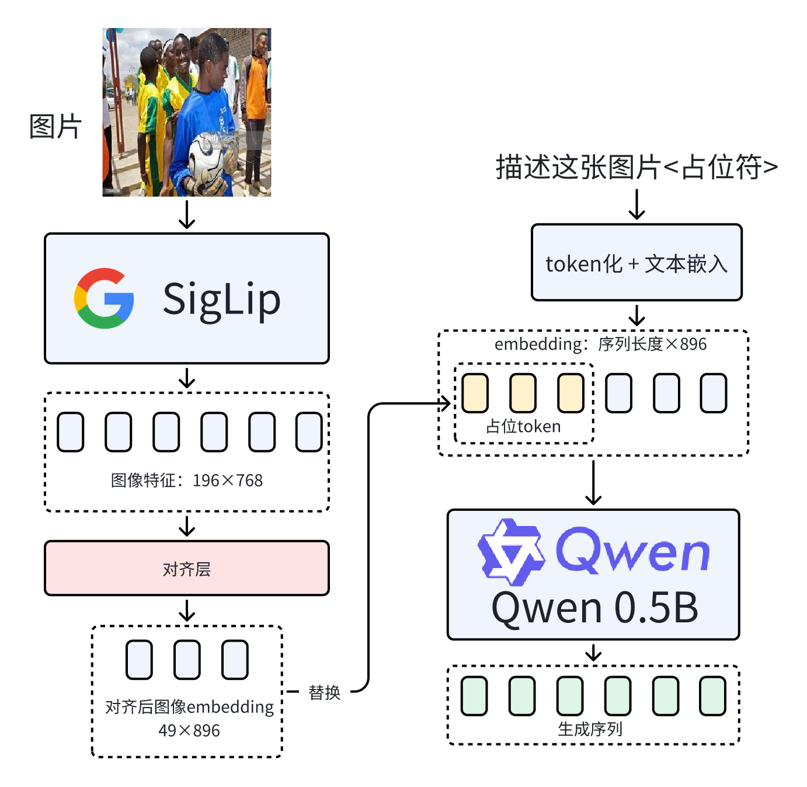
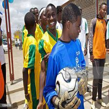
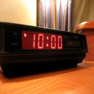
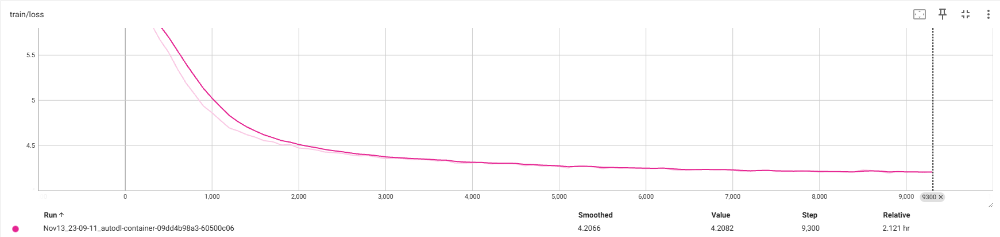
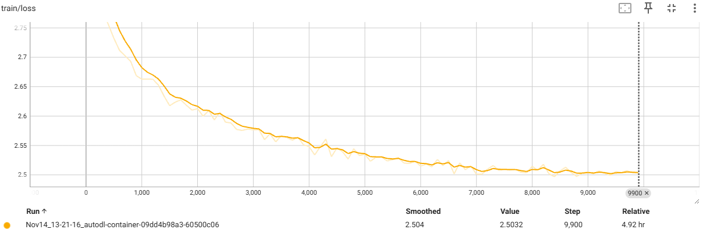
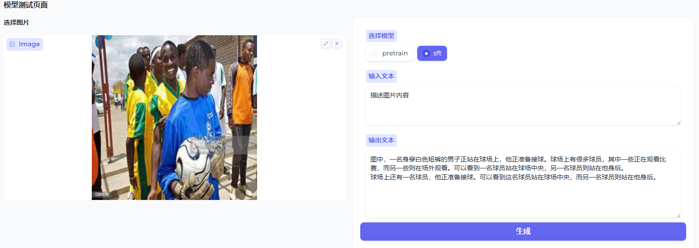

# Qwen-SigLIP 多模态视觉问答系统

本项目基于 Qwen2.5-0.5B 语言模型和 SigLIP 视觉编码器构建了一个多模态模型，赋予了Qwen2.5的文本模型视觉理解能力。

## 🎯 项目概述

这是一个用于学习的多模态大模型项目，一方面通过拼接视觉编码器和语言模型深入理解多模态大模型的底层框架，另一方面通过预训练和指令微调两个阶段了解大模型训练的全流程，以及为何需要pretrain+SFT的原因。

## 🔍 算法原理
### 模型架构
目前VLM的模型架构都是在LLM上拼接一个视觉模块用于提取图像特征, 将提取的图像特征加入到LLM的embedding序列中实现对图像的编码和理解。

根据上述模型结构设计，本项目将SigLip拼接到Qwen2.5-0.5B上，对齐了SigLip的输出与Qwen2.5-0.5B的输入。核心是训练了一个**对齐层**，让Qwen2.5-0.5B能够拿到并理解图像的特征，模型架构如下所示：

### 损失函数
预训练和指令微调都选择交叉熵损失函数:

$$
\text{CrossEntropy-Loss}=-\sum_{t=1}^T\log P_\theta(x_t|x_{<T})
$$

#### 推导过程
LLM本质是一个词表维度的分类任务，因此选用交叉熵作为损失函数，交叉熵表示为

$$
\text{CrossEntropy}=-\sum_{i=1}^N y_i\log p_i
$$

对于一条长度为$T$的序列来说，交叉熵为：

$$
\text{CrossEntropy}=-\sum_{t=1}^T\sum_{i=1}^N y_i\log p_i
$$

label中每个token用one-hot编码，因此label的概率分布中只有$x_t$对应位置的概率为1，其余都是0。因此可以写为

$$
\text{CrossEntropy-Loss}=-\sum_{t=1}^T\log P_\theta(x_t|x_{<T})
$$

式中$x_t$表示真实序列中第$t$位置的token，$P_\theta(x_t)$表示模型生成第$t$个token为$x_t$的概率。

## 📚 数据集内容
### 预训练数据格式

```json
{
  "id": "GCC_train_001830363",
  "image": "GCC_train_001830363.jpg",
  "conversations": [
    {
      "from": "human",
      "value": "<image>\nDescribe the provided image briefly."
    },
    {
      "from": "gpt",
      "value": "The team members are getting ready for the competition at the opening ceremony"
    }
  ]
}
```
### 指令微调数据格式

```json
{
    "conversations": [
        {
            "role": "user",
            "content": "闹钟的位置对睡眠质量有什么影响？<image>"
        },
        {
            "role": "assistant",
            "content": "把数字闹钟放在床头柜或光线充足的木桌上，会在几个方面影响睡眠质量。红色发光屏幕上显示着时间（晚上10点），发出的光可能让人分心或者引起不适，使人难以入睡。夜间暴露于哪怕少量的光线中都能干扰褪黑素的产生，而褪黑素有调节睡眠周期的作用。为了确保更好的睡眠质量，可以将时钟屏幕调暗、把它远离床摆放，或是移到房间里视线较不那么好的地方。此外，睡觉前让房间保持明亮也会扰乱自然的睡眠循环，所以关掉或调低任何不必要的灯光能够改善整体的睡眠环境。"
        }
    ],
    "image": "train-00000-of-00001_image_0_0.jpg"
}
```

## 📊 效果展示

### 运行环境
- **硬件配置**: 2 × AutoDL vGPU-32GB
- **预训练时间**: 2小时
- **微调训练时间**: 5小时

### 训练效果
#### 损失函数变化
*预训练和SFT阶段的损失函数变化曲线*


*图1: 预训练阶段损失函数变化*


*图2: 监督微调阶段损失函数变化*

### 问答效果展示
*实际问答效果示例*
（预训练用的是英文数据，预训练后模型仅能通过英文回答；SFT用的是中文数据，SFT后模型能通过中文回答并有较好的指令遵从能力）

*图3: 图像问答效果展示*

## 🚀 项目部署运行

### 模型和数据集下载

```bash
# 模型或数据有网络问题可以在modelscope或者hf镜像站下载

# 下载Qwen2.5-0.5B-Instruct模型
huggingface-cli download Qwen/Qwen2.5-0.5B-Instruct --local-dir ./Qwen2.5-0.5B-Instruct

# 下载SigLIP视觉编码器
huggingface-cli download google/siglip-base-patch16-224 --local-dir ./siglip-base-patch16-224

# 预训练数据
huggingface-cli download SYSUMage/LLaVA-CC3M-Pretrain-595K --local-dir ./data/pretrain

# 中文指令数据
huggingface-cli download LinkSoul/Chinese-LLaVA-Vision-Instructions --local-dir ./data/chinese

# SFT数据
huggingface-cli download jingyaogong/minimind-v_dataset --local-dir ./data/sft
```

### 依赖安装

```bash
pip install uv
uv sync
```

### 训练步骤

```bash
# pretrain
python train.py
accelerate launch train.py # 兼容accelerate分布式训练
# sft
python sft_train.py
accelerate launch sft_train.py # 兼容accelerate分布式训练
# 效果演示
python app.py
```

## 🛠️ 关键技术

- **特征对齐**: 训练两层线性映射对齐视觉输出与LLM输入
- **参数冻结**: 预训练冻结基础模型, 仅训练对齐层
- **指令微调**: SFT仅冻结视觉模型参数, 指令微调LLM遵循图像描述指令

## 📖 参考资料

1. 感谢[知乎大佬](https://zhuanlan.zhihu.com/p/1929249822956843927)分享的VLM模型背景知识和拼接思路
2. 感谢[B站大佬](https://space.bilibili.com/349950942?spm_id_from=333.337.0.0)分享的训练思路, 互联网导师

## 🤝 贡献与交流

欢迎提交Issue和Pull Request来改进项目。这是一个探索性的学习项目，旨在分享多模态模型训练和部署的经验。

## 📄 许可证

本项目采用开源许可证，详见LICENSE文件。

---

**注意**: 这是一个以探索和学习为目标的项目，代码实现可能存在不足之处。如果您发现任何问题，欢迎提出Issue或PR。感谢您的指正和交流！
